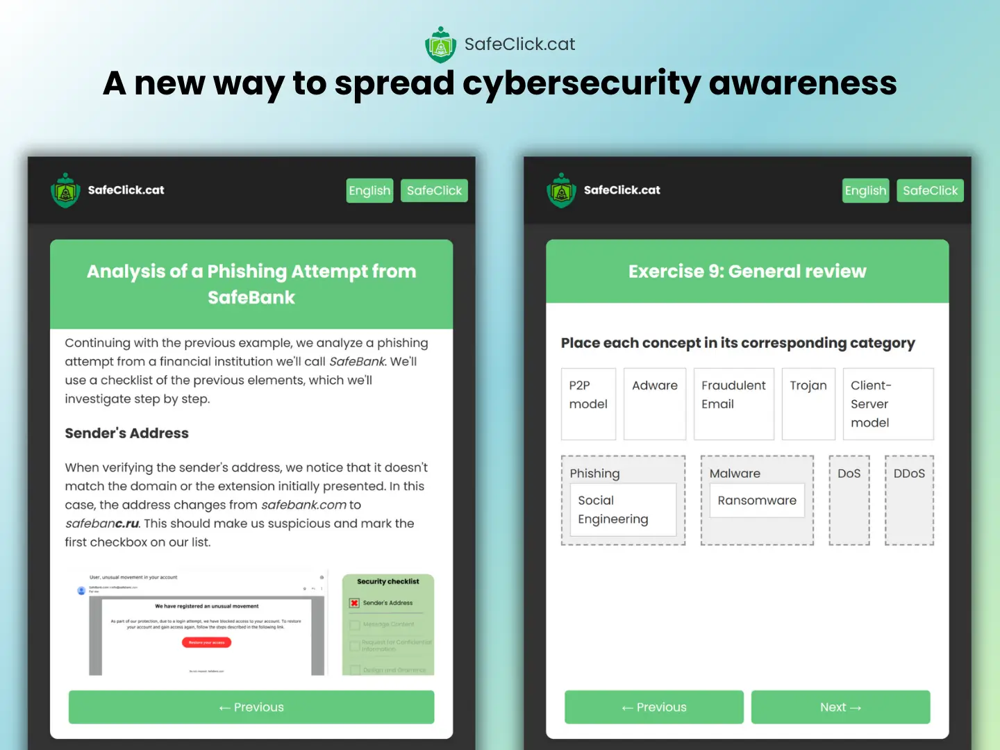

## How to Run the Code

### Prerequisites
- PHP
- Composer

### Steps
1. Clone the repository by running the following command: ``git clone https://github.com/ikipm/SafeClick``
2. Duplicate the `.env.example` file and modify the values to match your requirements.
3. Navigate into the project directory and install the framework and its libraries by running: ``composer install``
4. Generate a unique key within the `.env` file by executing the following command within the project directory: ``php artisan key:generate``
5. Perform database migrations by running the following command within the project directory: ``php artisan migrate``
6. To deploy the front-end, first install the necessary dependencies by running: ``npm install``
7. Run the npm commands:\
&nbsp;&nbsp;&nbsp;&nbsp;&nbsp;&nbsp;7.1. For development deployment, run: ``npm run dev``\
&nbsp;&nbsp;&nbsp;&nbsp;&nbsp;&nbsp;7.2. For production deployment, run: ``npm run prod``
8. Finally, execute the application by running: ``php artisan serve``

## Contributors
- [Iker Pérez (Ikipm)](https://github.com/ikipm)